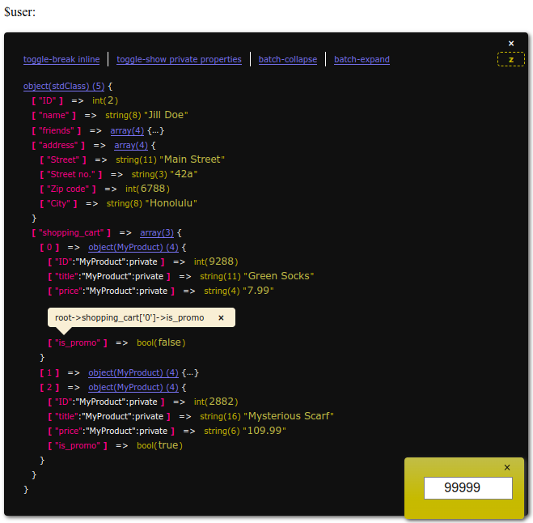

# InteractiveVarDump

An interactive alternative to PHP's native `var_dump()` function intended as a mere development and debugging tool. As such, it is not recommended to leave these calls and imports lingering in the production environment.

It is interactive insofar as it lets you …

* … collapse and expand the individual children of the tree.
* … display the path of deep tree nodes by clicking on an array key or object property. Use triple-click for copy-n-paste.
* … click on the Z button in the top right corner in order to adjust z-index on the fly. If, for example, a website element like a header bar is partially blocking the view. Type directly in the "z-indexer" box; hold <kbd>↑</kbd> or <kbd>↓</kbd>; or use the mousewheel while hovering over the box.



> Note: Does not work with some few data types, i.e.:
>
> * `DOMDocument` due to a bug in the Reflection framework: https://bugs.php.net/bug.php?id=48527
> * `RecursiveDirectoryIterator`


 　​

## Setup

Download the zip / tarball and unpack it, then `require` or `include` the file `InteractiveVarDump/autoload.php` into your working environment as shown in the examples below, in order to get access to the global wrapper functions `ivd` and `qvd`.


 　​

## Basic Usage

If you prefer working with classes:

```php
require_once InteractiveVarDump/autoload.php;

$user = get_user();

// Variant #1:
InteractiveVarDump::dump($user);

// Variant #2:
IVD::dump($user);

// Variant #3:
ivd($user);
```


　​

Make use of the optional second argument or PHP's native `compact()` function in order to distinguish several trees and values from one another:

Example #1:

```php
ivd($price, 'before conversion');

$price = convert($price);

ivd($price, 'after');
```


　​

Example #2:

```
public function calculate( ...$args ) {

	ivd($args, __METHOD__);

	// …
}
```


　​

Example #3:

```
$teamA = $defender->getPlayers();
$teamB = $challenger->getPlayers();
$score = $game->getScore();

ivd(compact('teamA', 'teamB', 'score'));
```


Example #4:

```php
foreach ($rows as $row) {
	ivd($row, 'row', array('indent' => 0));

	foreach ($row as $field => $value) {
		ivd(array(
			'field' => $field,
			'formatted' => formatter($value),

		), 'each value', array('indent' => 1));
		// …
	}
}
```


　​

If, in rare cases, you wish to skip the CSS and JavaScript includes, you can use either of these following shorthands for what you possibly would have done anyway:

```php
qvd($my_var);
IVD::simple($my_var);

// →
echo '<pre style="white-space: pre-wrap;">'; var_dump($my_var); echo '</pre><br />';
```

> Note: This simpler, secondary shorthand also supports the pretext, but not the configuration argument.


　​

Depending on the complexity of the dumped variable, additional overhead links will appear automatically in the head of the tree.

Link | Functionality
---- | -------------
`toggle-break inline` | Values appear either in the same line or in a new line. If you prefer that part of the native `var_dump()`.
`toggle-show public  properties` | Show or hide all public properties.
`toggle-show private properties` | Show or hide all private properties.
`batch-collapse` | Recursively collapse all child and grandchild objects and arrays; but not the root.
`batch-expand` | Recursively expands all child and grandchild objects and arrays.


　​

> Note: The tool automatically detects and marks strings if they contain HTML-entities.
>
> Compare how, although being displayed in the browser as `Kirby's Dream Course`, the string value is actually `Kirby&#39;s Dream Course`.


 　​

## Extended Usage

Optionally, you can add a configuration array as a third parameter for some light extra functionality.

Option | Type | Default | Description
------ | ---- | ------- | -----------
`return` | boolean | `FALSE` | Set to `TRUE` in order to get the tree as a return value instead.
`color` | string | `all` | If neither the key/value nor the link colorization is for you, you can deactivate those colors granularly: [ `all`, `link`, `box`, `none` ].
`max_depth` | integer | `10` | By default, a check for too deep nesting is implemented in order to prevent a fatal exception for circular object references. Modify the depth to your needs. Minimal value: `2`.
`indent` | integer | `0` | Indentation level. Indent the box in increments of 15px; supports up to 20.
`start_collapsed` | boolean | `FALSE` | Will have the root-node collapsed on page-load.
`z_index` | integer\|numstring | - | Set a starting `z_index` CSS value on page-load.


　​

## Depencendies

* PHP 7.4
* [jQuery](https://github.com/jquery/jquery) v1.11.0

