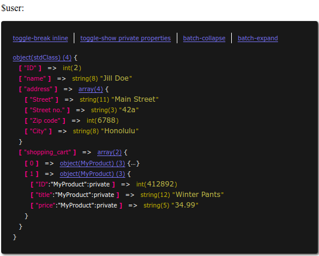

# InteractiveVarDump
An interactive alternative to PHP's native `var_dump()` function, insofar as it lets you collapse and expand the individual children.

*NOTE:* Does not work with some data types, i.e.:
- objects of the class `DOMDocument` due to a bug in the Reflection framework: https://bugs.php.net/bug.php?id=48527
- `RecursiveDirectoryIterator`

## Basic Usage
- `require` or `include` the file `InteractiveVarDump/functions.php` into your working environment.
- Call `ivd( $any_var );`.
- Optionally add a string: `ivd( $any_object, 'This is $any_var' );`.
- Alternatively, call `qvd( $any_var )` for a very quick native `var_dump` call wrapped in a `‹pre›` tag.

Depending on the complexity of the variable, additional overhead links will appear in the head of the tree.

Link | Functionality
---- | -------------
`toggle-break inline` | Values appear either in the same line or in a new line.
`toggle-show public  properties` | Recursively show or hide all public  properties.
`toggle-show private properties` | Recursively show or hide all private properties.
`batch-collapse` | Collapse all child and grandchild objects and arrays; but not the root.
`batch-expand` | Expands all child and grandchild objects and arrays.

*NOTE:* The tool automatically detects and marks strings if they contain HTML-entities: compare how, although being displayed in the browser as "Kirby's Dream Course", the string value is actually "Kirby\&#39;s Dream Course".

## Extended Usage
Optionally, you can add a config-style array as a third parameter for some light extra functionality.

Option | Type | Default | Description
------ | ---- | ------- | -----------
`return` | Boolean | `FALSE` | Set to `TRUE` in order to get the tree as a return value instead.
`color` | String | `"all"` | If neither the key/value nor the link colorization is for you, you can deactivate those colors granularly: [ `all`, `link`, `none` ].
`max_depth` | Integer | `10` | By default, a check for too deep nesting is implemented in order to prevent a fatal exception for circular object references. Modify the depth to your needs.
